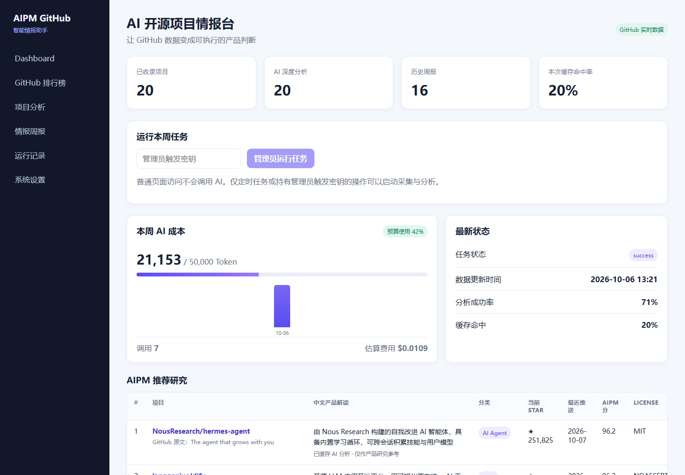
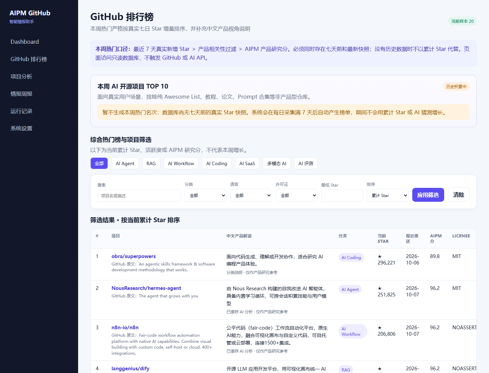
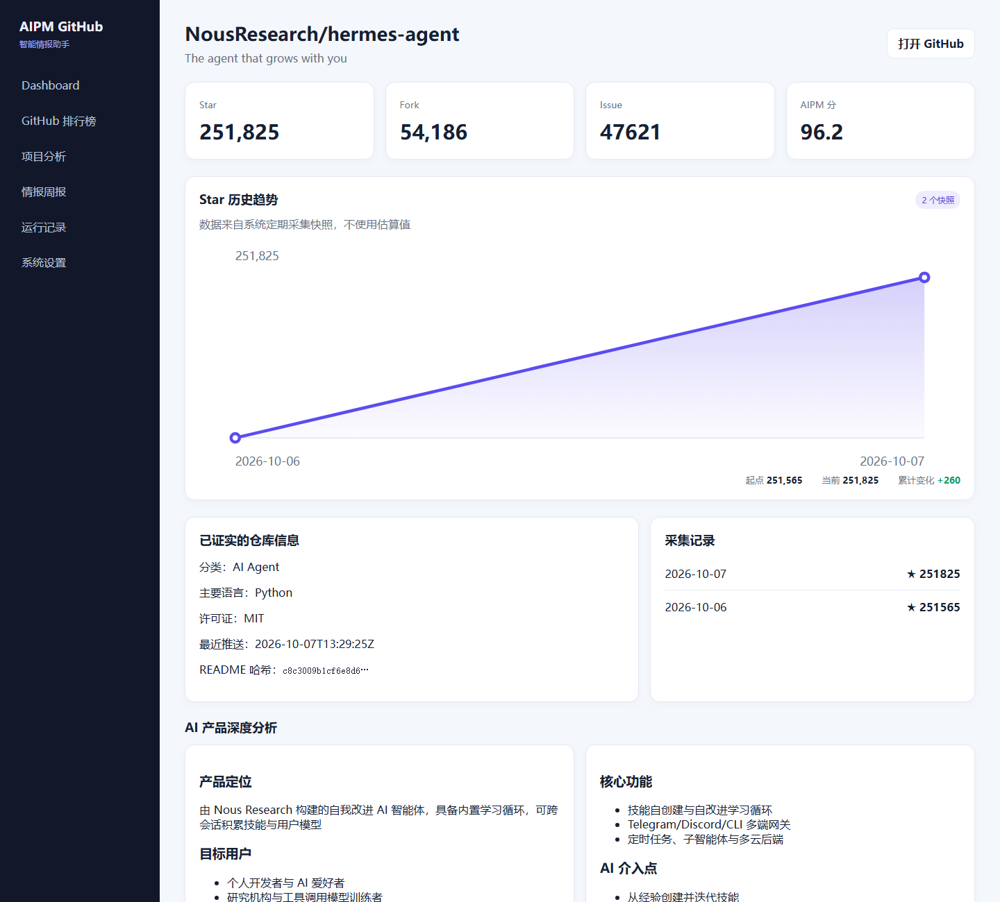
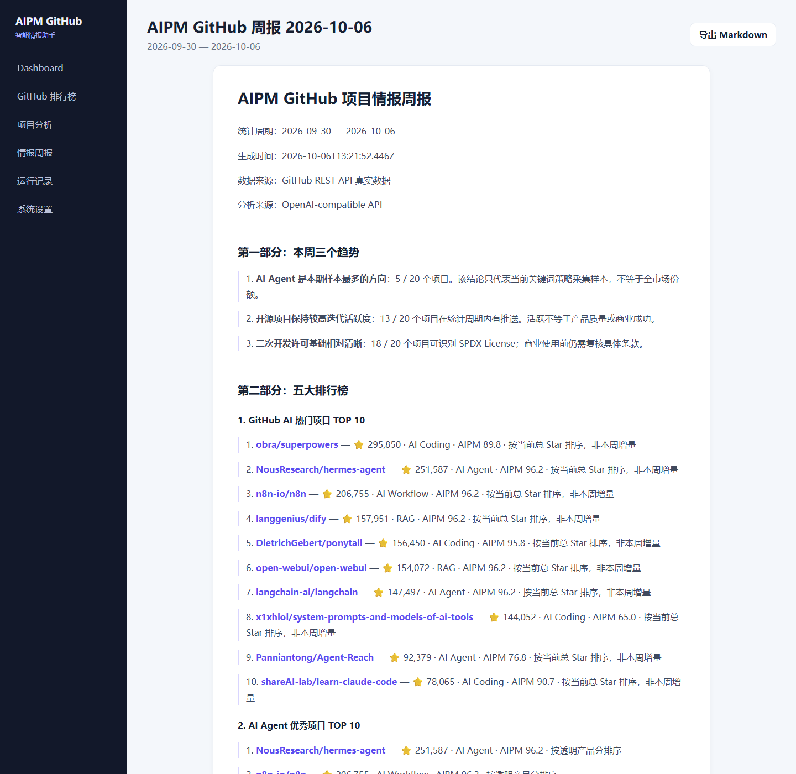

# AIPM GitHub Intelligence

> 面向 AI 产品经理的 GitHub 开源项目情报平台：自动采集真实仓库数据，计算可解释排行榜，只对新增或重要变化项目使用 AI，并沉淀为可追溯的每周产品情报。

[在线体验](https://aipm-web-production-e652.up.railway.app/) · [产品设计](docs/product-design.md) · [AI 策略](docs/ai-strategy.md) · [评测体系](docs/evaluation.md) · [成本优化](docs/cost-optimization.md)

**当前版本：** `0.1.0`　 **状态：** 可运行 MVP　 **测试：** 37 项通过　 **License：** MIT

## 30 秒了解这个项目

| 问题 | 产品解法 |
| --- | --- |
| GitHub AI 项目太多，人工筛选耗时 | 按七个 AI 领域定时采集、去重和过滤 |
| 常见榜单只看技术热度 | 同时解释目标用户、产品价值、商业潜力与复刻价值 |
| 每周重复研究同一个项目，浪费 Token | README/核心数据指纹 + 持久化分析缓存 |
| “本周热门”容易用累计 Star 冒充增长 | 每日保存快照，严格按真实七日 Star 增量计算 |
| AI Key、余额或模型服务不稳定 | 主站降级为只读历史数据，仅暂停新的 AI 分析 |

**完整闭环：** GitHub REST API → SQLite 快照 → 程序化排行榜 → 变化检测 → AI 结构化分析 → 周报持久化 → Dashboard 展示与 Markdown 导出。

## 产品截图

### Dashboard



### GitHub 排行榜



### 项目详情与 AI 分析



### 情报周报



## 产品能力

- **真实 GitHub 采集**：覆盖 AI Agent、RAG、AI Workflow、AI Coding、AI SaaS、多模态和 AI Evaluation，记录 Star、Fork、Issue、语言、License、活跃时间、README 与来源 URL。
- **四类核心榜单**：累计热度、真实 30 日增长、最近活跃度、透明 AIPM 推荐分；另提供严格按真实七日增量计算的“本周热门”。
- **AI 产品分析**：输出定位、用户、痛点、功能、AI 介入点、差异化、商业潜力、学习价值与二次开发可行性。
- **每周情报报告**：生成趋势、五大榜单、三个深度项目、两个复刻建议、三个学习点与下周观察项，支持 Markdown 导出。
- **成本与可靠性**：缓存、Token/费用预算、超时、有限重试、任务锁、调用审计、友好降级和 Mock 零成本模式。
- **数据可追溯**：项目来源、分析日期、任务状态、模型、Token、费用、缓存命中与错误记录均可查询。

## 产品设计亮点

### 1. 事实、规则与 AI 分工明确

- GitHub 负责仓库事实；
- 程序负责去重、快照差值和排行榜；
- LLM 只负责需要语义理解的产品分析；
- 页面把“GitHub 已证实”与“AI 推测”分开展示。

模型不参与计算 Star 增长，也不能把商业判断描述为已经验证的市场事实。

### 2. 首次运行不制造虚假增长

七日和三十日增长都依赖数据库历史快照。历史不足时，页面明确显示“历史数据积累中”，不会用累计 Star 或模型猜测补位。

### 3. 页面访问零模型调用

Dashboard、排行榜、项目详情和历史周报默认读取 SQLite。连续刷新或多个用户访问同一报告都读取同一份持久化结果，不会按访问量放大 AI 成本。

### 4. AI 异常不拖垮网站

缺少 Key、余额不足、Spend Limit、Rate Limit、超时、服务异常或 Schema 失败时，只暂停新的 AI 分析；GitHub 数据、排行榜、历史报告与历史分析仍可正常浏览。

## 排行榜口径

| 榜单 | 排序依据 | 防误导规则 |
| --- | --- | --- |
| 本周热门 TOP 10 | 真实七日 Star 增量 | 必须有前后快照；过滤教程、论文、Prompt 合集等非产品仓库 |
| 综合热门 TOP 20 | 当前累计 Star | 明确标注为存量热度，不代表近期增长 |
| 近 30 天增长 TOP 10 | 本地快照差值 | 没有 30 天历史就不生成名次 |
| 最近活跃 TOP 10 | GitHub `pushed_at` | 活跃度不等于产品质量 |
| AIPM 推荐 TOP 10 | 热度、活跃、完整性、研究价值各 25% | 程序透明计算，不由模型直接打分 |

详细规则见 [产品设计说明](docs/product-design.md)。

## AI 与成本优化

每个项目的分析指纹由 README 哈希、描述、License、Homepage、分类和 Star/Fork 变化区间组成。缓存键还包括模型、Prompt 版本和 Schema 版本。

只有首次出现或发生重要变化的项目才进入 AI 队列。调用前检查每日、每周、单次 Token 上限，以及每日、每周费用上限；预算不足时继续完成数据采集和周报保存。

系统记录每次调用的模型、输入/输出 Token、估算费用、缓存命中、成功状态与时间。模型价格由环境变量配置，不硬编码。详见 [成本优化说明](docs/cost-optimization.md)。

## AI 服务降级策略

```text
AI 请求
  ├─ 成功且通过 Schema → 保存新分析
  ├─ 暂时故障 → 最多有限重试一次 → 展示最近一次分析
  ├─ 余额/认证/配置错误 → 不重试 → 暂停新分析
  └─ 预算不足 → 不发请求 → 保留采集、榜单与周报
```

前端只显示安全的用户提示；API Key、上游响应正文和服务器堆栈不会发送给浏览器。

## 技术架构

```text
Next.js 16 + React 19 + TypeScript
  ├─ Server Components：只读 Dashboard 与报告页面
  ├─ Route Handlers：手动任务、诊断、健康检查、Markdown 导出
  ├─ GitHub REST API：搜索、仓库元数据与 README
  ├─ OpenAI-compatible API：结构化产品分析
  ├─ Zod：AI JSON Schema 校验
  ├─ SQLite (node:sqlite)：项目、快照、分析、周报、成本与任务锁
  └─ node-cron：每日快照 + 每周完整管线
```

部署使用 Docker 与 Railway 持久卷。当前 SQLite 方案适合单实例 MVP；多实例扩展前应迁移 PostgreSQL 与分布式任务队列。

## 数据库结构

| 表 | 作用 |
| --- | --- |
| `projects` | 仓库事实、README、产品分和分析指纹 |
| `project_snapshots` | 每日 Star/Fork/Issue 历史 |
| `analyses` | 结构化 AI 分析与版本化缓存 |
| `weekly_reports` | 生成时固化的 Markdown 周报 |
| `pipeline_runs` | 任务状态、采集量、分析量与关联报告 |
| `ai_usage` | 模型、Token、费用、缓存与成功率 |
| `service_status` / `ai_error_logs` | 降级状态与安全错误日志 |
| `job_locks` | 防止定时任务重复执行 |
| `schema_migrations` | 数据库迁移记录 |

数据库在启动时自动初始化并按 `schema_migrations` 增量迁移，不需要手动执行 SQL。

## 本地运行

### 环境要求

- Node.js 24+
- npm
- 可选：GitHub Fine-grained PAT（提高 API 配额）
- 可选：OpenAI-compatible 模型 API Key

### 安装

```bash
git clone https://github.com/huahuayugouzi-commits/aipm-github-intelligence.git
cd aipm-github-intelligence
npm ci
cp .env.example .env
npm run dev
```

打开 `http://localhost:3000`。默认配置使用 Mock 数据和 Mock AI，不需要密钥，也不会产生模型费用。

### 使用真实数据

在本地 `.env` 中设置：

```dotenv
DATA_MODE=github
GITHUB_TOKEN=your_github_token
AI_PROVIDER=openai
AI_API_KEY=your_model_api_key
AI_BASE_URL=https://api.openai.com/v1
AI_MODEL=your_model_name
PIPELINE_SECRET=generate_a_long_random_value
```

`.env`、本地数据库、日志和构建产物均已被 `.gitignore` 排除。不要把真实密钥填写到 `.env.example` 或客户端代码中。

## 环境变量

| 变量 | 用途 | 默认值 |
| --- | --- | --- |
| `GITHUB_TOKEN` | GitHub REST API 服务端凭据 | 空 |
| `GITHUB_PROJECTS_PER_CATEGORY` | 每类候选项目数量 | `8` |
| `DATA_MODE` | `mock` 或 `github` | 按 Key 自动判断 |
| `AI_PROVIDER` | `mock` 或 `openai` | 按 Key 自动判断 |
| `AI_API_KEY` / `AI_BASE_URL` / `AI_MODEL` | OpenAI-compatible 服务 | 见 `.env.example` |
| `AI_INPUT_PRICE` / `AI_OUTPUT_PRICE` | 每百万 Token 单价 | `0` |
| `AI_DAILY_TOKEN_BUDGET` / `AI_WEEKLY_TOKEN_BUDGET` | 日/周 Token 上限 | `15000` / `50000` |
| `AI_RUN_TOKEN_BUDGET` | 单任务 Token 上限 | `30000` |
| `AI_DAILY_COST_BUDGET` / `AI_WEEKLY_COST_BUDGET` | 日/周费用上限 | `1` / `5` |
| `AI_MAX_PROJECTS_PER_RUN` | 单次最多分析项目数 | `5` |
| `AI_MAX_INPUT_CHARS` / `AI_MAX_OUTPUT_TOKENS` | 输入/输出限制 | `18000` / `1800` |
| `AI_TIMEOUT_MS` | 单次模型超时 | `60000` |
| `APP_TIMEZONE` | 定时任务时区 | `Asia/Shanghai` |
| `CRON_SCHEDULE` | 每周完整任务 | `0 9 * * 1` |
| `SNAPSHOT_CRON_SCHEDULE` | 每日轻量快照 | `30 8 * * *` |
| `DATABASE_PATH` | SQLite 路径 | `./data/aipm.db` |
| `PIPELINE_SECRET` | 外部手动触发鉴权 | 空 |

完整模板见 [.env.example](.env.example)。

## 测试与验收

```bash
npm test
npm run lint
npm run build
```

当前共有 37 项自动化测试，覆盖 GitHub 请求失败、Rate Limit、首次运行、项目去重、缓存、AI Schema、预算、降级、任务锁、部分失败、只读页面、本周热门口径和每日快照等场景。详见 [评测与可靠性](docs/evaluation.md)。

## 部署

项目包含 `Dockerfile`、健康检查 `/api/health` 与 `railway.json`。在 Railway 部署时：

1. 创建持久卷并将 `DATABASE_PATH` 指向卷内路径；
2. 在 Railway Variables 中配置密钥和预算；
3. 保持单实例运行 SQLite；
4. 通过健康检查后再手动运行一次完整任务；
5. 验证每周 Cron 与每日快照任务的运行记录。

不要把本地 `.env` 或数据库提交到 GitHub。生产数据备份应通过平台持久卷或受控导出完成。

## 技术难点与解决方案

| 难点 | 解决方案 |
| --- | --- |
| 区分累计热度与近期增长 | 持久化每日快照，增长榜只做快照差值 |
| 降低重复 AI 成本 | 变化指纹、版本化缓存、页面只读和项目数量上限 |
| AI 输出不稳定 | 严格 JSON 提示词 + Zod Schema + 失败审计 |
| 模型故障导致白屏 | 分离采集/展示/分析，安全状态码与历史结果回退 |
| 定时任务重复执行 | SQLite TTL 任务锁与运行记录 |
| 商业判断被误读为事实 | `verifiedFacts` / `assumptions` 分层与证据等级 |

## 产品迭代记录

当前目录在此次公开准备前没有可验证的 Git 历史，因此不虚构版本时间线。`package.json` 的当前版本为 `0.1.0`，公开仓库初始化后将从该版本建立可追溯的提交与 Release 记录。

已完成的 MVP 能力包括：真实 GitHub 采集、SQLite 快照、透明排行榜、AI 结构化分析、缓存、预算、降级、周报、Markdown 导出、定时任务、运行审计和 Railway 部署。

## Roadmap

- [ ] 连续积累 30 天真实快照并增加增长异常检测
- [ ] 建立人工标注 Golden Set 与 AI Bad Case 工作台
- [ ] 为产品型项目过滤器评估 Precision / Recall
- [ ] 迁移 PostgreSQL，支持多实例和分布式任务锁
- [ ] 增加月度预算、成本预警和单位有效分析成本
- [ ] 为 AI 结论增加 README 证据片段引用

## 数据与责任说明

- GitHub 数据存在 API 时间差，Star、Issue 和活跃时间以最近一次采集为准。
- 搜索结果代表当前关键词策略覆盖的样本，不等于整个 AI 开源市场。
- AI 结论是产品研究辅助，不构成市场验证、投资建议或法律意见。
- 商业使用任何开源项目之前，请复核其完整 License 与依赖许可。

## License

[MIT](LICENSE)
